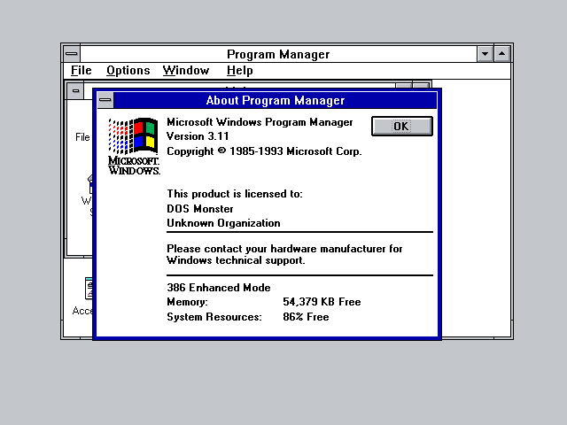
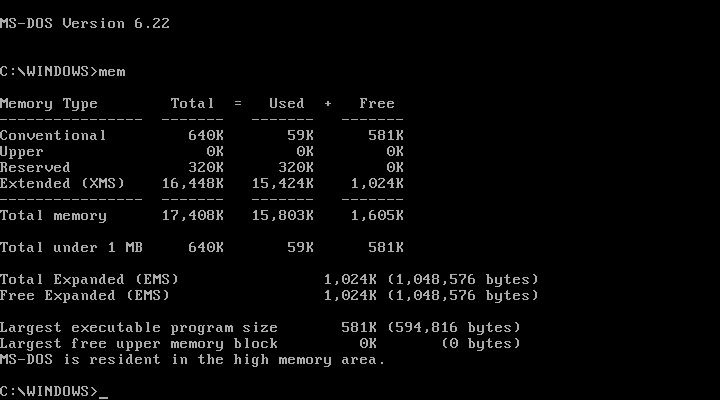
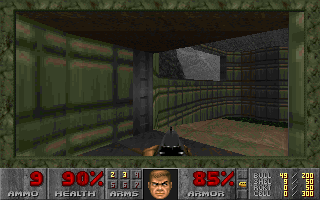
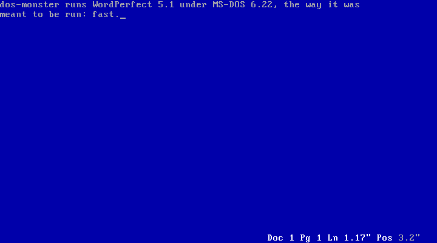
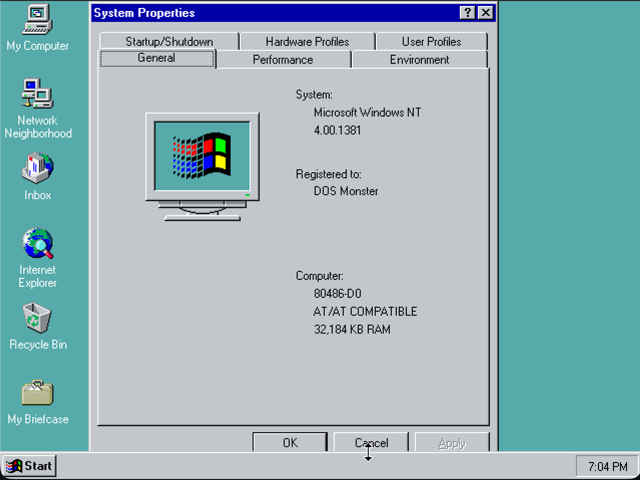
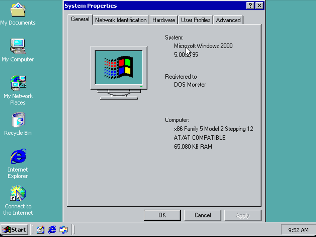

# dos-monster

An 8086–Pentium PC emulator built around a dynamic binary translator: x86
real mode, protected mode, virtual-8086 mode and paging, and the 387/486
floating-point unit, translated to AArch64 or x86-64 at run time, with
the goal of running DOS software at billions of instructions per second.
It installs and boots FreeDOS, MS-DOS 6.22, Windows 3.11 in 386 enhanced
mode, Windows NT 4.0 and Windows 2000 from disk images, and runs DOOM,
WordPerfect 5.1, Turbo Pascal and Microsoft COBOL. It builds for macOS,
Linux and Windows.

It is the successor to [z80](https://github.com/brazilofmux/z80) (Z80 +
CP/M at 4.3 BIPS), [slow-32](https://github.com/brazilofmux/slow32-public)
and [riscv](https://github.com/brazilofmux/riscv), and reuses their
translator's design: pinned guest registers, two-phase translation with
dead-flag elimination, block chaining, a span-gated self-modifying-code
bitmap, and lockstep verification against an interpreter.

| | |
|---|---|
|  |  |
| Windows 3.11 in 386 enhanced mode | An MS-DOS Prompt: a V86 VM beside Windows |
|  |  |
| DOOM (DOS/4GW via VCPI) under MS-DOS + EMM386 | WordPerfect 5.1 under MS-DOS 6.22 |
|  |  |
| Windows NT 4.0 on the 486 (`-m 486`) | Windows 2000 on the Pentium (`-m 586`) |

## What runs

Two ways to run things:

- **As a PC booted from disk images** (`-boot`): a BIOS, INT 13h over
  diskette and hard-disk images, the two 8259s, the 8254, the 8042 with a
  PS/2 mouse, an MC146818 real-time clock, an IDE (ATA) controller with
  an AT disk BIOS that drives it in real instructions, a VGA (text, mode
  13h and unchained, 16-colour planar modes), A20, and up to 257 MB of
  memory (`-mem`). The CPU is an 8086, 186, 286, 386, 486 or Pentium
  (`-m`), with an x87 on the 486 and the Pentium (and beside a 386 with
  `-fpu`). On it:
  - FreeDOS 1.3 — installed by its own installer; under HIMEMX, JEMMEX
    and JEMM386
  - MS-DOS 6.22 — installed by its own Setup from diskette images; under
    HIMEM and EMM386 (UMBs, EMS)
  - Windows 3.11 — installed by its own Setup; standard mode and 386
    enhanced mode, with MS-DOS Prompt VMs
  - DOOM (DOS/4GW) under all of the above: raw XMS, VCPI under EMM386,
    and DPMI inside a Windows DOS box
  - Windows NT 4.0 Workstation and Windows 2000 Professional — installed
    by their own Setup (WINNT from MS-DOS, the CD copied to a hard disk),
    to the desktop
  - Linux 6.12 (Tiny Core 16.2, loaded by GRUB 2 from a disk image) on the
    Pentium, to a shell — from its initramfs, or with its root filesystem
    on the IDE disk (ext2, through Linux's own pata_legacy), and on the
    network: an Intel 82545EM on a PCI bus (-nic e1000,user), DHCP, DNS and
    TCP out through a NAT (libslirp); and Purdue's Xinu, with a serial
    console (-com1) and the same card
  - Slackware 3.1 ("Slackware 96": Linux 2.0.0, gcc 2.7.2, XFree86 3.1.2)
    — installed by its own setup from its disk sets on a DOS partition,
    booted by LILO
- **As a DOS program runner** (the default): an emulated DOS (INT 21h in
  the host, a host directory as C:, a DPMI host of our own) for running a
  program headless — WordPerfect 5.1, Turbo Pascal 5.5, MS COBOL 5.0,
  DJGPP programs, DOOM. This is the bring-up and test harness; real DOS
  from images is the target.

## How fast

On an Apple Silicon Mac, DOOM's `-timedemo demo1` (5026 frames):

| | realtics |
|---|---|
| bare MS-DOS 6.22 (HIMEM) | 93 (≈1,900 frames/s) |
| Windows 3.11 enhanced mode, MS-DOS Prompt | 174 |
| MS-DOS 6.22 + EMM386 | 180 |

Power-on to `C:\>` is 2.5 s (2 of them MS-DOS's own F5/F8 pause), and
`win` to a drawn Program Manager 0.8 s. `tests/boot/bench.sh` measures
these.

The same timedemo on the same machine (medians, 2026-09-25):

| | realtics | |
|---|---|---|
| **dos-monster** (MS-DOS 6.22) | **93** | |
| DOSBox-X 2026.08, `core=dynamic` (dynrec), `cycles=max`, its built-in DOS | 667 | 7.2× |
| DOSBox-X, `core=normal` | 1,154 | 12.4× |
| Bochs 3.1 (`clock: sync=realtime`, MS-DOS 6.22) | 1,224 | 13.2× |

QEMU 11 (TCG, `qemu-system-i386`) was still in the middle of the demo
after 90 seconds, and none of three runs lived to print a result, so it
has no number here. [`docs/bench/`](docs/bench/) has every configuration,
the individual runs, and `doom-timedemo.sh`, which reruns the comparison.
One workload, one machine: take it as a data point.

### Why it is fast

A translator is fast when the code it emits does only the guest's work.
What dos-monster does to get there:

- **Guest registers live in host registers.** AX–DI, the DS/ES/SS
  segment bases, FLAGS, the guest-memory base and the instruction
  counter are pinned to AArch64 registers for the life of translated
  code. A guest `ADD AX,BX` is a host `ADD`, not a load, an add and a
  store through a CPU-state structure.
- **Flags are dead until proven live — decided at translation time.**
  Each block is decoded whole, then scanned backwards for which flags
  anything reads before they are overwritten; only those are computed.
  Most arithmetic's flags die immediately, and a compare followed by a
  jump becomes a host compare and branch on the host's own condition
  codes. That is static dead-flag elimination, not lazy flags: there is
  no deferred-flag state to save and replay at run time.
- **Blocks jump straight to blocks.** An exit to a known target is
  patched into a direct branch once the target is translated; indirect
  jumps and returns probe the block cache inline. Near and far CALL and
  RET, INT n and OUT stay inside translated code.
- **Guest memory is one host buffer.** A real-mode address is a pinned
  segment base plus an offset. The 1 MB wrap is not masked on every
  access: the 64 KB above 1 MB is a second mapping of the first 64 KB
  while A20 is off, and of the real memory once it is on. The A20 state is
  part of each block's key, so flipping the gate (HIMEM does it thousands
  of times while it tests memory) costs nothing.
- **Self-modifying code costs one byte-load per store.** A bitmap marks
  every byte translated code covers; a store checks its byte and moves on.
  Code that keeps patching itself — DOOM's renderer rewrites immediates in
  its inner loops — gets those immediates read at run time instead of
  being retranslated after every patch.
- **No cycle counting.** Nothing is paced per instruction. Interrupts are
  taken when a pinned counter runs out at a block boundary, so the hot
  path carries no event checks.
- **Paging stays in translated code.** Under a memory manager or Windows,
  a guest access goes through a software TLB inline, blocks are keyed by
  address space so switching page tables (a VCPI client does it on every
  DOS call) keeps them, and stores to video memory under paging take the
  same fast path as without it.

And it is checked: `-V` runs every translated block in lockstep with the
interpreter, and the full DOOM timedemo under EMM386 — 5.5 billion
instructions — runs clean that way.

## Building

Developed on macOS on Apple Silicon (the AArch64 backend, `dbt/dbt_a64.c`)
and on x86-64 Linux (the x86-64 backend, `dbt/dbt_x64.c`). Both translate
every kind of block: real mode, V86, flat 32-bit and segmented 16-bit
protected mode, all of them under paging too, with x87 ops as helpers in
the block; both pass the translator fuzzers and the DOS suite, under
`-V` too. On x86-64, DOOM's timedemo takes about 177–190 realtics as a
DOS program on an EC2 Xeon Platinum 8259CL, and DOOM runs at about 950
MIPS on a Cascade Lake t3.2xlarge under Windows. The backend is chosen
by the host
(`BACKEND=a64|x64` overrides it, for the golden set).

    make                 # dos-monster, tools/sst, tools/jittest
    make ARCH=a64        # cross-compile the AArch64 build on x86-64 Linux into build-a64/
                         # (runs under qemu-user-static's binfmt)

Needs a C11 compiler and zlib; SDL2 (via `pkg-config`) adds a window for
graphics modes and is optional — without it the machine is headless.
libslirp (also via `pkg-config`; `brew install libslirp`, `apt install
libslirp-dev`) puts a network behind the e1000 (`-nic e1000,user`) and is
optional too — without it the card has nothing on the other end.
The tests also use `nasm`, `python3`, `mtools`, `qemu-system-i386` and
`bochs`. The x87's arithmetic is Berkeley SoftFloat 3e (BSD licence,
`core/softfloat/COPYING.txt`).

### Windows

x86-64 Windows 10 1803 or later, built with MSVC (Visual Studio's C
compiler) and nmake, from an "x64 Native Tools Command Prompt":

    vcpkg install --triplet x64-windows-static --x-install-root=build-win\vcpkg
    nmake /f Makefile.win               # build-win\dos-monster.exe, tools\sst.exe, tools\jittest.exe
    nmake /f Makefile.win test-jit

vcpkg (Visual Studio's own will do) brings SDL2 and zlib as static
libraries (`vcpkg.json`), so the one .exe is all there is to copy. The
POSIX the sources use comes from `win/`: `win/posix.h` is force-included
into every file and maps it onto Win32. The terminal is the Windows
console with its VT sequences on, so `-t` works in Windows Terminal or a
console window; under mintty (Git Bash) stdout is a pipe, not a
terminal, so use `-w` for the window there. A list of diskettes (`-A`,
`-fda`) is separated by `;` rather than `:`.

## Running

    ./dos-monster -m 386 -C ~/dos WP.EXE              # a program, emulated DOS
    ./dos-monster -m 386 -hda c.img -boot c           # boot a hard-disk image
    ./dos-monster -m 386 -fda a1.img:a2.img -boot a   # diskettes; ESC + swaps
    ./dos-monster -m 586 -mem 64 -hda c.img -hdb d.img -boot c   # a Pentium with 64 MB, two disks

`-V` runs the translator in lockstep with the interpreter and stops at
the first difference; `-s` prints statistics; `-h` lists the rest.

## Disk images

No DOS software is included — bring your own copies into `disks/`
(git-ignored). `tests/boot/README` has the recipes: where FreeDOS 1.3
comes from and how its installer is driven, and
`tests/boot/msinstall.sh` / `tests/boot/wininstall.sh`, which install
MS-DOS 6.22 and Windows 3.11 from diskette images end to end, unattended.
NT 4.0 and Windows 2000 install from MS-DOS on a hard disk: copy the CD's
`I386` folder to a second disk image (FAT16; 500 MB is enough for NT 4,
Windows 2000 wants about 2 GB) and run `WINNT` from it.

## Testing

- `make test-sst` — the interpreter against the
  [SingleStepTests](https://github.com/SingleStepTests) 8088 suite
  (`tests/sst8088/fetch.sh`; 286 and 386 suites too)
- `make test-jit` — the translator against the interpreter, instruction
  sequences fuzzed in real mode, flat and segmented protected mode
- `make test-pm`, `test-pm-compare`, `test-pg` — protected mode, paging
  and V86 mode against QEMU and Bochs, and the 486's and the Pentium's
  additions against Bochs as each (`tools/pmoracle`: boot images that
  log their observations)
- `make test-fpu` — the x87: 6,600 cases (every instruction, the awkward
  operands, rounding and precision control, masked and unmasked
  exceptions) against Bochs's transcript, adjudicated where Bochs is the
  one that is off; the transcendentals against mpmath (`fpuacc.py`)
- `make test-dos` — DOS programs under the interpreter, the JIT and `-V`
- `make test-boot` — FreeDOS, MS-DOS and Windows booted from images and
  driven by `tools/expect.py`

## Layout

    core/   the x86: decoder, interpreter, paging, the x87 (and SoftFloat)
    dbt/    the translator (AArch64 and x86-64)
    pc/     the machine: BIOS, VGA, keyboard, timer, disks, CMOS, mouse
    dos/    the emulated DOS, MZ loader, DPMI host
    tools/  oracles, fuzzers, expect.py, the native BIOS routine
    tests/  DOS test programs, boot tests, test-suite runners
    win/    the POSIX subset over Win32, for the MSVC build

`CLAUDE.md` is the design document: scope, architecture, and the rules
learned the hard way.

## License

MIT — see `LICENSE`.
